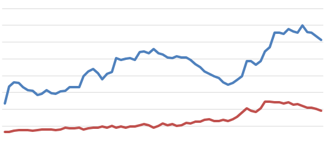
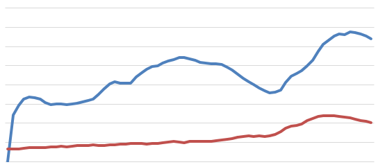
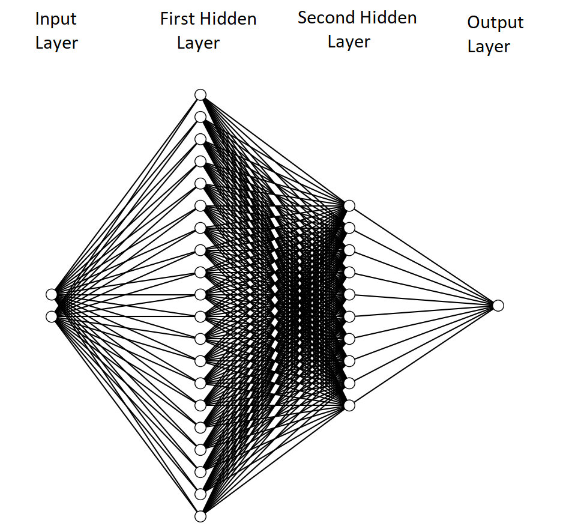
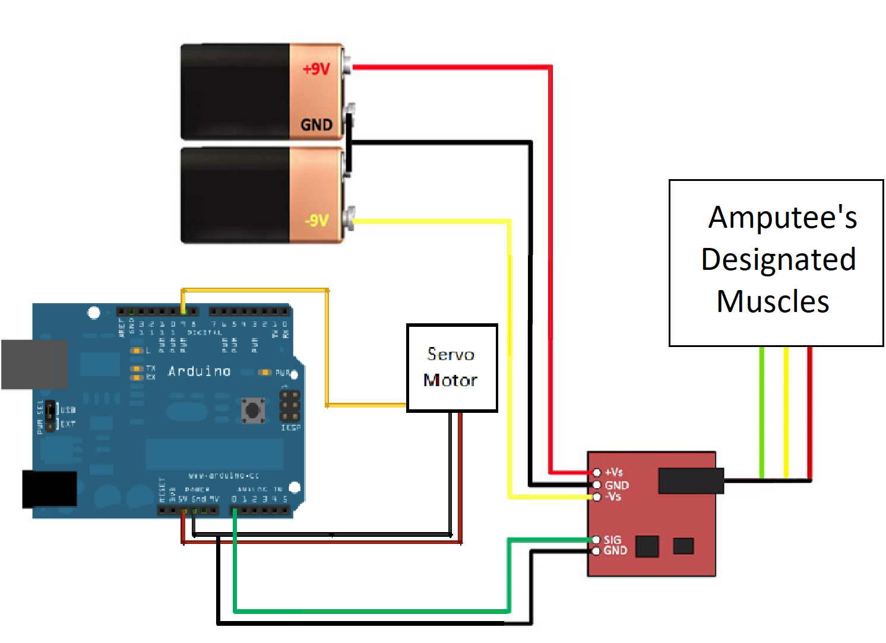

# EMG Controlled Prosthetic Limb

A robotic leg that reads muscle signals and actuates accordingly, it figures out the required angle using a trained neural network.

## The Entire Leg

## Notable Components:
- Arduino Uno board
- EMG V3 muscle sensors
- High torque servo motor
- Gyroscopes for angle measurement

## Muscle Signal/Angle  Reading:

The muscle signal and the angle readings were taken concurrently.

-   The code is in the path: Graduation-Project/Data_Acquisition_Code.ino

## Excel:
The siganls were taken to excel where they were filtered.
The gyroscope gave back very precise readings, with 2 decimal points which were ceiled/floored to make mapping easier for the neural net.

- Some portion before smoothing:

- The same portion after smoothing:

## Neural Network:
The neural network was trained to output angle commands to the motors in response to muscle signals.
Keras was used to implement this.

## Actuation Circuit:
The resulting NN model was implemented into the arduino and was used to calculate the required angle for the muscle signals in real time.

- The code is in the path: Graduation-Project/Neural_Network_Arduino_Implementation   
